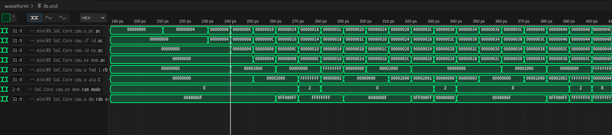

为了优化流水线设计，我将MEM阶段和WB阶段放在了同一个时钟周期，没有使用段寄存器，理由如下：
1. 大部分指令没有访存操作，因此可以直接在这一时钟周期完成写回操作；
2. 对于store指令，没有写回操作，因此可以直接在这一时钟周期完成访存操作；
3. 对于load指令，由于DRAM是异步读取，可以在这一时钟周期完成读取并准备好写回的数据，在下一个时钟上升沿写回，而不需要通过段寄存器延迟一个时钟周期。

## andi指令波形分析

测试样例：

```assembly
00000000 <_start>:
   0:	0040006f          	jal	x0,4 <reset_vector>

00000004 <reset_vector>:
   4:	ff0100b7          	lui	x1,0xff010
   8:	f0008093          	addi	x1,x1,-256 # ff00ff00 <_end+0xff00df00>
   c:	f0f0f713          	andi	x14,x1,-241
  10:	ff0103b7          	lui	x7,0xff010
  14:	f0038393          	addi	x7,x7,-256 # ff00ff00 <_end+0xff00df00>
  18:	00200193          	addi	x3,x0,2
  1c:	1a771463          	bne	x14,x7,1c4 <fail>
```


如图所示，可以看到：

1. 240ps时，`andi x14,x1,-241`指令在IF阶段，`addi x1,x1,-256`指令在ID阶段，`lui x1,0xff010`指令在EX阶段；
2. 250ps时，`andi`指令进入ID阶段，`addi`指令进入EX阶段，`lui`指令进入MEM&WB阶段；
3. 250ps时，`andi`的第一个操作数为x1，x1的较新值目前仍在EX阶段尚未写回，通过前递逻辑从EX阶段取得，为`0xff00ff00`；
4. 250ps时，`andi`的第二个操作数为-241，-241经过符号拓展为`0xffffff0f`；
5. 260ps时，两个操作数的值以及各种控制信号通过ID_EX段寄存器传递给EX阶段；
6. 260ps时，`andi`指令进入EX阶段，`addi`指令进入MEM&WB阶段；
7. 260ps时，`alu.C=0xff00ff00 & 0xffffff0f = 0xff000f00`，通过EX_MEM段寄存器传递给MEM&WB阶段；
8. 270ps时，`andi`指令进入MEM&WB阶段，`wb_wD=0xff000f00`，写回寄存器x14；


## lb指令波形分析

测试样例：

```assembly
00000000 <_start>:
   0:	0040006f          	jal	x0,4 <reset_vector>

00000004 <reset_vector>:
   4:	000020b7          	lui	x1,0x2
   8:	00008093          	addi	x1,x1,0 # 2000 <begin_signature>
   c:	00008703          	lb	x14,0(x1)
  10:	fff00393          	addi	x7,x0,-1
  14:	00200193          	addi	x3,x0,2
  18:	22771c63          	bne	x14,x7,250 <fail>
```



如图所示，可以看到：

1. 240ps时，`lb x14,0(x1)`指令在IF阶段，`addi x1,x1,0`指令在ID阶段，`lui x1,0x2`指令在EX阶段；
2. 250ps时，`lb`指令进入ID阶段，`addi`指令进入EX阶段，`lui`指令进入MEM&WB阶段；
3. 250ps时，`lb`指令需要获取EX阶段的操作数，即基地址和偏移量，其中基地址（即x1寄存器）的较新值目前仍在EX阶段尚未写回，通过前递逻辑从EX阶段取得，为`0x00002000`；
4. 250ps时，`lb`指令的偏移量为0，经过符号拓展为`0x00000000`；
5. 260ps时，两个操作数的值以及各种控制信号通过ID_EX段寄存器传递给EX阶段；
6. 260ps时，`lb`指令进入EX阶段，`addi`指令进入MEM&WB阶段；
7. 260ps时，`alu.C=0x00002000 + 0x00000000 = 0x00002000`，通过EX_MEM段寄存器传递给MEM&WB阶段；
8. 270ps时，`lb`指令进入MEM&WB阶段，通过DM模块从地址0x2000读取数据，此时`ex_mem.ram_mode=2`，即单字节读取模式，读取到的单字节经过符号拓展为`dm.rdo_ext=0xffffffff`；
9. 270ps时，`wb_wD=0xffffffff`，写回寄存器x14；


## beq指令波形分析

测试样例：

```assembly
00000000 <_start>:
   0:	0040006f          	jal	x0,4 <reset_vector>

00000004 <reset_vector>:
   4:	00200193          	addi	x3,x0,2
   8:	00000093          	addi	x1,x0,0
   c:	00000113          	addi	x2,x0,0
  10:	00208663          	beq	x1,x2,1c <reset_vector+0x18>
  14:	2a301863          	bne	x0,x3,2c4 <fail>
  18:	00301663          	bne	x0,x3,24 <test_3>
  1c:	fe208ee3          	beq	x1,x2,18 <reset_vector+0x14>
  20:	2a301263          	bne	x0,x3,2c4 <fail>
```


如图所示，可以看到：

1. 250ps时，`beq x1,x2,1c`指令在IF阶段，`addi x1,x0,0`指令在ID阶段，`addi x2,x0,0`指令在EX阶段，`addi x3,x0,2`指令在MEM&WB阶段；
2. 260ps时，`beq`指令进入ID阶段，`addi x1,x0,0`指令进入EX阶段，`addi x2,x0,0`指令进入MEM&WB阶段；
3. 260ps时，`beq`指令的第一个操作数x1的较新值目前仍在EX阶段尚未写回，通过前递逻辑从EX阶段取得，为`0x00000000`；
4. 260ps时，`beq`指令的第二个操作数x2的较新值目前仍在MEM&WB阶段尚未写回，通过前递逻辑从MEM&WB阶段取得，为`0x00000000`；
5. 270ps时，两个操作数的值以及各种控制信号通过ID_EX段寄存器传递给EX阶段；
6. 270ps时，`beq`指令进入EX阶段，`addi x1,x0,0`指令进入MEM&WB阶段；
7. 270ps时，`alu.zf=1`，即相等比较运算结果为真，`beq`指令判定为需要跳转，`ex_b`信号为1；
8. 270ps时，冒险处理逻辑根据`ex_b`信号，指定`ex_nop=id_nop=1`，即在ID和EX阶段插入一条空指令；
9. 270ps时，NPC模块根据`ex_b`信号，指定`npc.npc=ex_pcb[31:2]=0x0000007`，即跳转到`0x0000001c`处；
10. 280ps时，`pc.pc=0x0000001c`，即跳转到`0x0000001c`处执行；